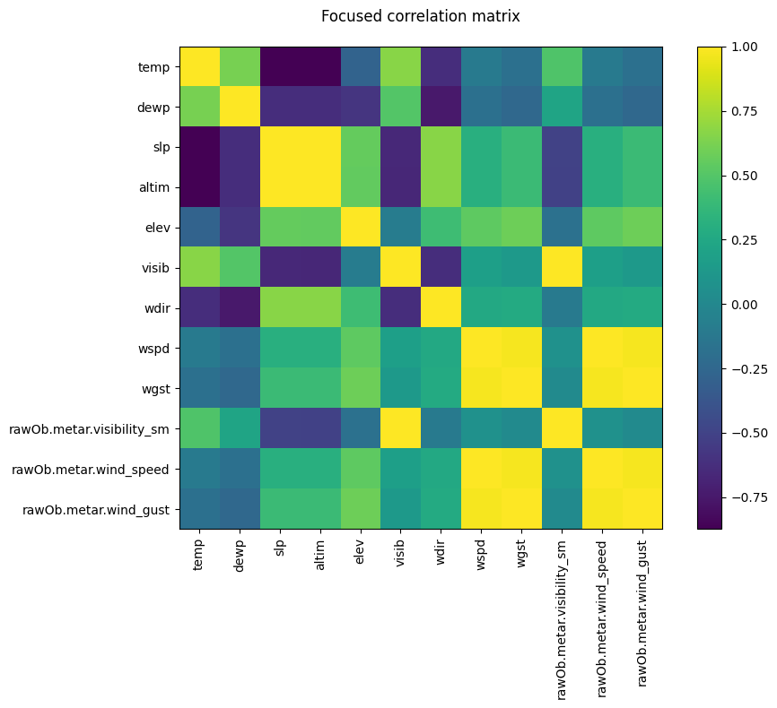
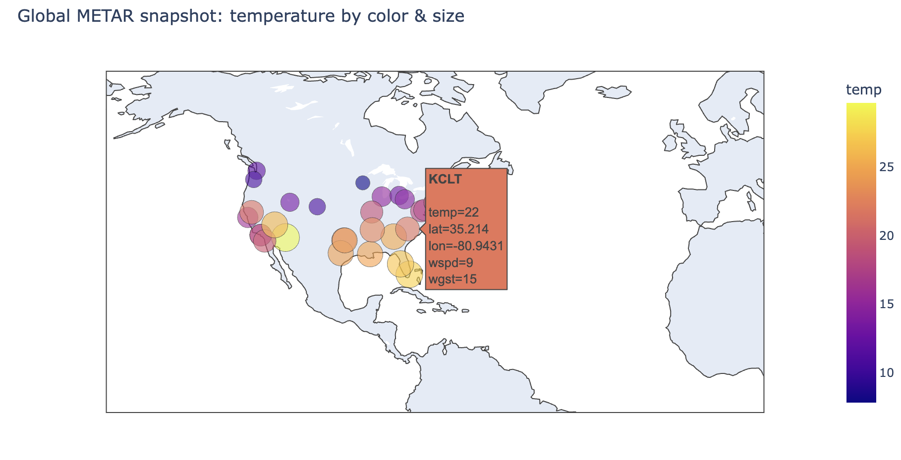

# JSON-Sift

**JSON-Sift** is a parser that works with weather data of civil air flights that come from APIs in JSON format.  
Such data contain various specific notations and a particular way of arrangement.  
This parser deals with recognizing embedded codes and transforming JSON into **CSV**,  
which is the most common format for working with data, processing, and analysis.  

I often work with data, and such a parser would make my work easier if, for example,  
I wanted to train a **model** on it or perform **EDA**.

---
> [!NOTE]
> Name selection

“Sift” in ukrainian means *просіювати*.  
Our data come in a very unclear format — sometimes presented just as a line of abbreviations and numbers,  
which is not visually understandable.  
My parser sifts this data through its filters and outputs data that can be worked with.  
That is why I named my project this way.

---
## Data Source
> [!NOTE]
> At the moment, the parser works with data from corresponding APIs.  
For demonstration purposes, the data are taken from the **AviationWeather (METAR)** API:  
[https://aviationweather.gov/help/data/#metar](https://aviationweather.gov/help/data/#metar)

---

## Purpose of the project

Currently, as I have already mentioned, the parser works with data from civil aviation flights.  
In general, the parser can be adapted to decode flight data of other flying devices such as **drones**,  
since this is a relevant topic in Ukraine.  

Since I don’t have access to real drone flight data, I use alternative data sources.  
In the future, if desired, the parser may include the possibility of configuration via a config file,  
in case the incoming data have a slightly different structure.

---
## Example of transformed data
Below is an example of how the raw aviation weather data looks **after being parsed and converted** into structured CSV format :


 --- 
## Getting Started

> [!TIP]
> To download the project use commands:
```
bash
git clone https://github.com/tsaebst/json_sift_parser_upd
cd json_sift_parser
cargo build
cargo install --path .

```

To start working, you need to install the project locally  
*(add detailed installation and run instructions here)*.

To begin, type:
```
jsonsift --help

```

# Project files:

```
json_sift_parser/
├── Cargo.toml              # metadata and dependencies
├── Makefile                #CLI build + tests
├── README.md               # project doumentation
├── config.json             # parser patterns and rules config
├── src/
│   ├── grammar.pest        # Metar grammar defining
│   ├── lib.rs              # parsing and transformation logic
|   |── metar.rs            #logic for metar transformations
│   └── main.rs             # cli entry point 
├── tests/
│   └── parser_tests.rs     # unit-tests for grammar (to be aaded for parsing logic)
├── result.csv              # outout CSV
├── contents/               # just folder with .png of applied side of my project
└── test.json               #json input data
```


## grammar.pest
The METAR grammar describes how the parser recognizes weather observation strings.  
These strings typically consist of compact tokens( combinations of letters, digits, and abbreviations) — that encode different metrics

---
## About grammar

> [!IMPORTANT]
> typical input looks like this:
> UKBB 121200Z 18005KT 10SM FEW020 15/10 A2992 RMK TEST

## Each segment is a token representing a distinct type of weather information.  
The grammar processes them using `pest` rules as follows:

| Rule | Meaning | Example |
|------|----------|---------|
| `station` | 4-letter station code | `UKBB`, `KJFK`, `EGLL` |
| `time` | UTC timestamp in `HHMMSSZ` format | `121200Z` |
| `wind` | Wind direction, speed, optional gust, and units | `18005KT`, `25010G15KT` |
| `visibility` | Horizontal visibility with optional prefixes | `10SM`, `M1/2SM`, `P6SM` |
| `clouds` | Cloud layers or clear condition | `FEW020`, `BKN100`, `CLR` |
| `temp_dew` | Temperature / dew point pair | `15/10`, `M02/M05` |
| `pressure` | Atmospheric pressure (inHg) | `A2992` |
| `remarks` | Free-text remarks | `RMK AO2 SLP123` |
| `known_keyword` | Recognized control words | `COR`, `AUTO`, `NOSIG` |
| `uppercase_token` | Any unknown uppercase abbreviation | `VV`, `CB`, `TS` |
| `separator` | Whitespace or line breaks | `" "` or `"\n"` |
| `unknown_token` | Fallback for any unrecognized token | `XYZ123` |

---

## Tests

JSON-Sift includes a set of unit tests (written via cargo)to verify the correctness of the METAR grammar and the future parsing logic implemented in `lib.rs`.  

| Test Type | Description |
|------------|-------------|
| **Grammar tests (`parser_tests.rs`)** | Validate the grammar rules defined in `grammar.pest`. Each METAR component (station, time, wind, etc.) is parsed and checked for correctness. |
| **Parsing logic tests** *(planned)* | Will validate transformation from raw METAR strings into structured JSON or CSV. |
| **JSON/CSV conversion tests** *(future work)* | Ensure flattened JSON structure and correct CSV export. |


To run all unit tests:

make test

---
## Parsing architecture

The crate is split into two logical parts:

- `src/lib.rs` —  JSON → flat map → CSV
- `src/metar.rs` — METAR grammar, token helpers, and decoding logic

---

## `src/lib.rs`

My parser tries to be as flexible as it can, so I tried to implement logic which can work with variations of Meatar data. 

* `parse_json()`
Parses input string as JSON using `serde_json::from_str`

* `convert_to_csv()`
gets JSON object or array. flattens each entry, collects all keys as CSV headers, and writes rows via `csv::Writer` using sorted columns

* `flatten()`
Recursively walks though objects, arrays, scalars in json, builds indexed keys, and redirects string vals to `parse_scalar`

* `parse_scalar()`
Normalizes str, tries to decode it as METAR via `metar::decode_metar`. if not - tokenizes and uses simple metar patterns or creates `token_n` columns

---

## `src/metar.rs`

* `SiftParser`
Pest-generated parser using `grammar.pest` rules for METAR reports.

* `decode_metar()`
Parses a full METAR string with `SiftParser`, walks through parse tree, and returns a flat map of normalized METAR fields/`None`

* `visit_metar()`
visits Pest parse pairs, matches basic rules, and fills the output map by using `apply_pattern` where possible 

* `complex_key_value()`
Splits a random string into tokens by whitespace and basic separators before pattern detection

* `is_code_like_token()` / `all_tokens_code_like()`
Detects whether tokens look like uppercase/number codes to decide if there's a pattern

* `SimplePattern`
enum for recognized token types `TempDew`, `Wind`, `Pressure`, `Time`, `Visibility`, `Cloud`, `FlightCategory`.

* `holds_pattern_value()`
Classifies a single token into one of the `SimplePattern` variants

* `apply_pattern()`
Expands a recognized pattern token into one or more well-named columns 

* `norm()`
Normalizes raw text
---

## Error handling

- JSON issues like invalid syntax, wrong encodin become `ParseError::Json`.
- Structural problems likeCSV write failures,wierd shapes become `ParseError::Structure`.

---
## `main.rs` – CLI entrypoint

The `main.rs` file defines the **command-line interface** and connects user commands with the core logic from `lib.rs`.

### What it does now

- Uses **clap** to expose subcommands:
  - `decode <file> [-o, --output <path>]`
    - Reads a JSON file from disk
    - Calls `parse_json()` from `lib.rs` to validate and load it
    - Calls `convert_to_csv()` to flatten and transform the data into CSV.
    - Prints the CSV to `stdout` or writes it to the specified `--output` file
  - `credits`
    - Prints project name, author, short technical description, and tech stack.

## How to run

You can interact with **JSON-Sift** directly from the terminal using Cargo or Make commands.

- **Run the program:**
``` 
bash
cargo run
```

- **Parse and save**
```
jsonsift decode test.json --output result.csv

```

---
## Examples of EDA with dataset my parser made:

* Rose of wind grpah:


* Correlation plot:



* Parametres ratio pictured on the world map:



 --- 

- **Credits**
```
cargo run -- credits

```

**Crates.io** – [check it out](https://crates.io/crates/json_sift_parser)

## Author
**Vladyslava Spitkovska** – [GitHub](https://github.com/tsaebst)
